# Tamatar Auth - Complete Authentication Flow Visualization

This document provides a comprehensive visualization of the authentication flows in the Tamatar Auth microservice.

## 🔐 Complete Authentication Architecture

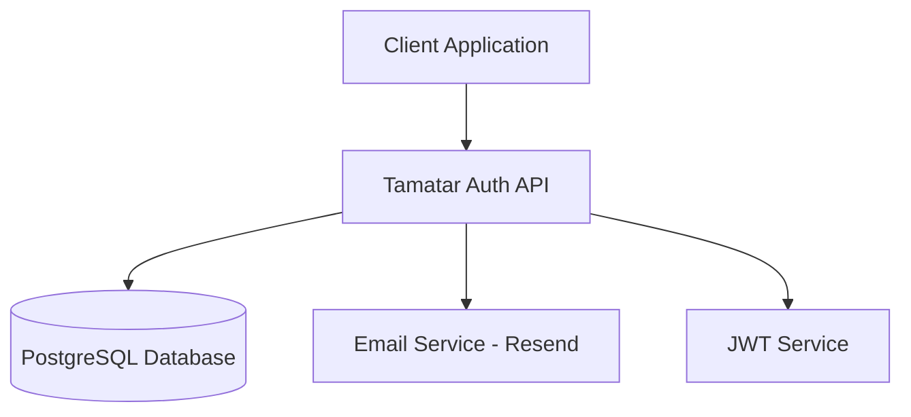

## 📋 Database Schema Overview

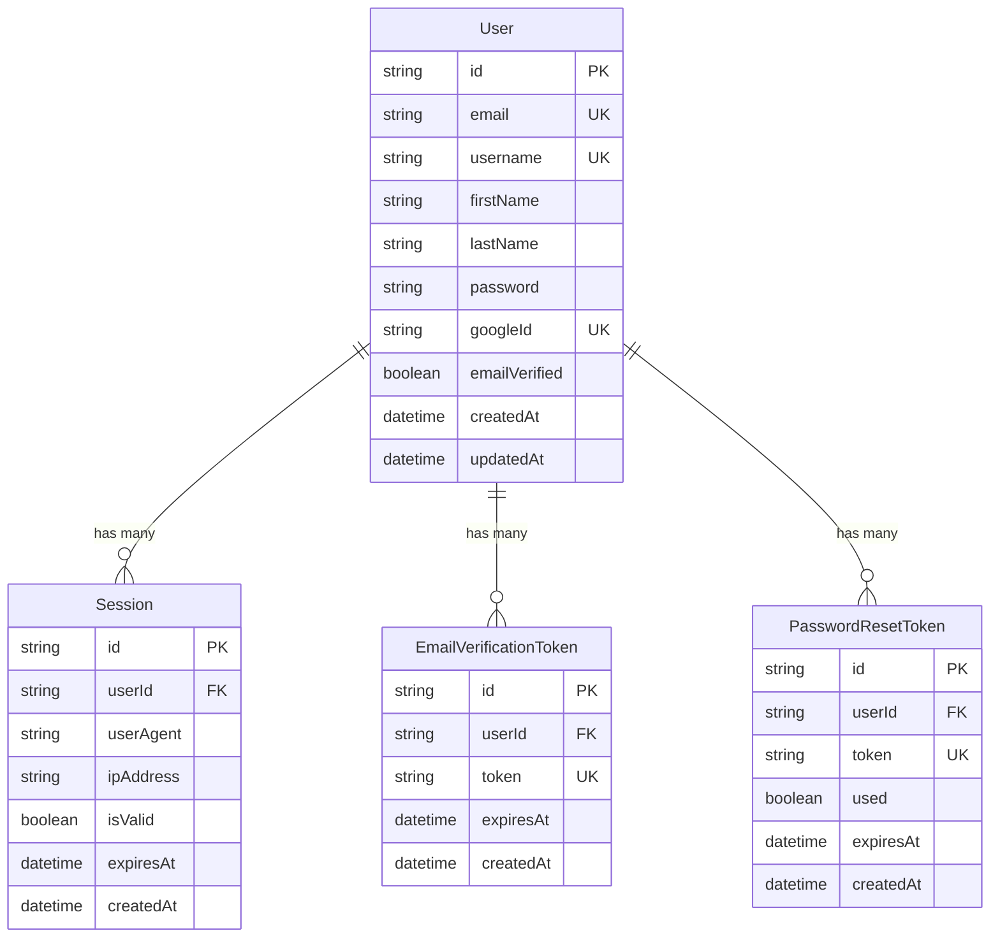

## 🚀 1. User Registration Flow

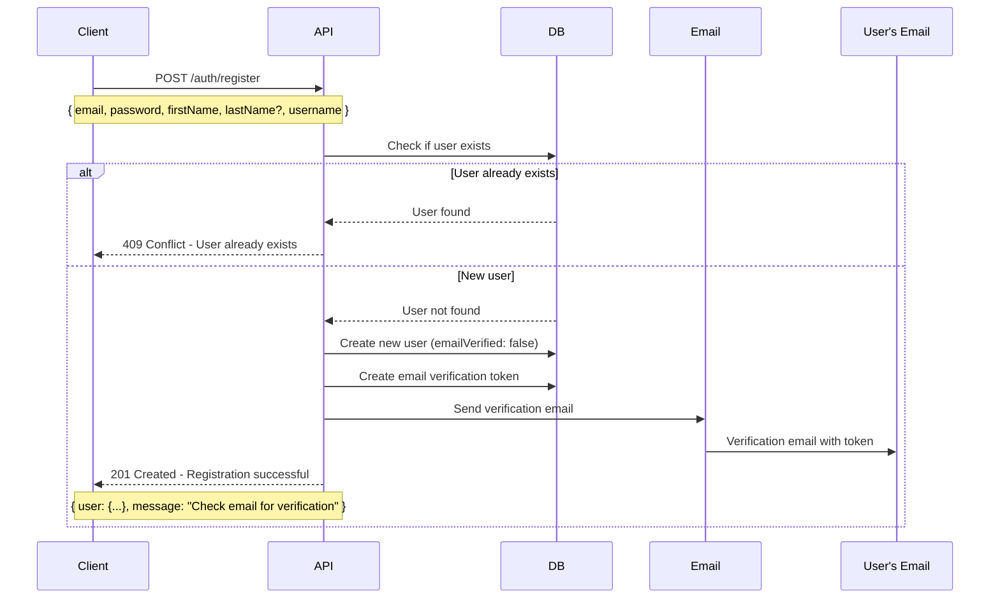

### Registration Endpoint Details
- **Route**: `POST /auth/register`
- **Validation**: Email format, password strength, required fields
- **Security**: Password hashing with bcrypt
- **Response**: User object (without password) + verification message

## ✉️ 2. Email Verification Flow

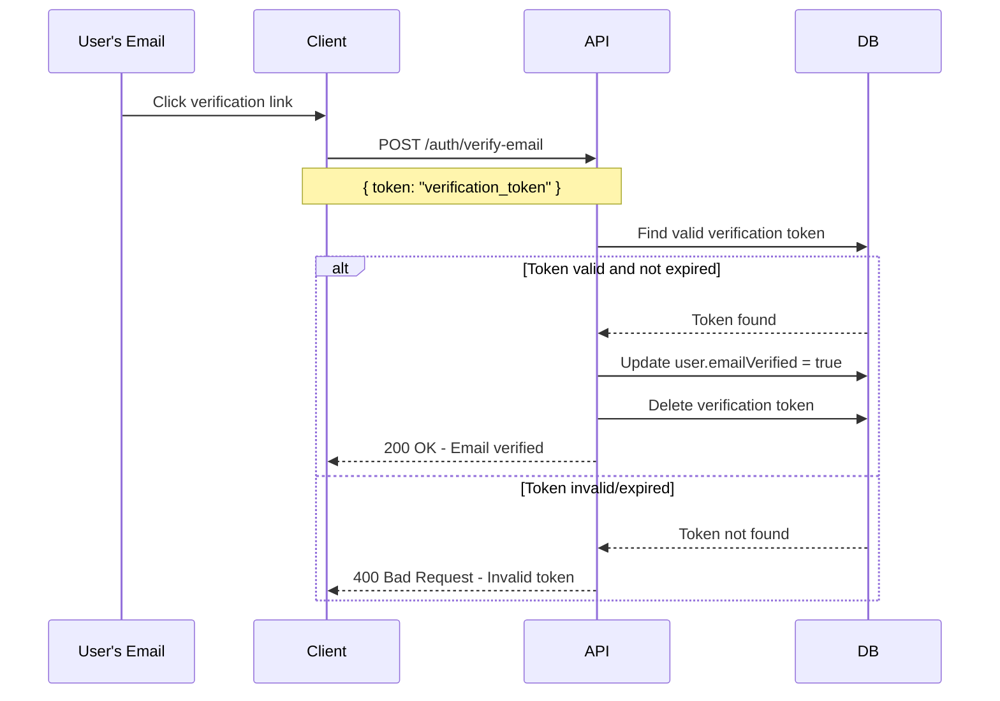

### Email Verification Details
- **Route**: `POST /auth/verify-email`
- **Token Expiry**: 24 hours
- **Security**: One-time use tokens, automatic cleanup

## 🔑 3. User Login Flow

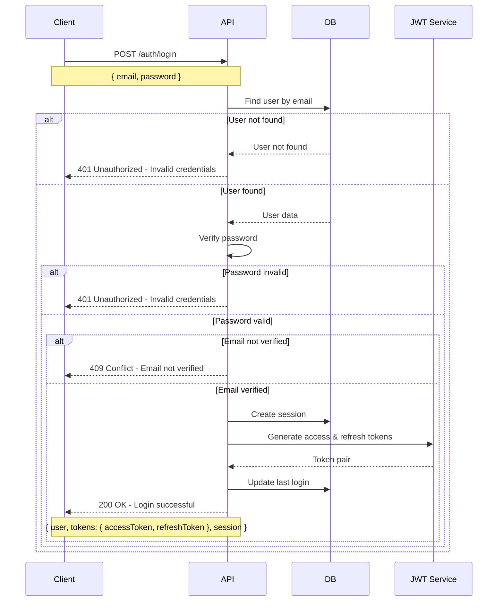

### Login Endpoint Details
- **Route**: `POST /auth/login`
- **Tokens**: Access token (15min) + Refresh token (7 days)
- **Session**: Stored in database with expiry
- **Security**: Rate limiting, password verification

## 🔄 4. Token Refresh Flow

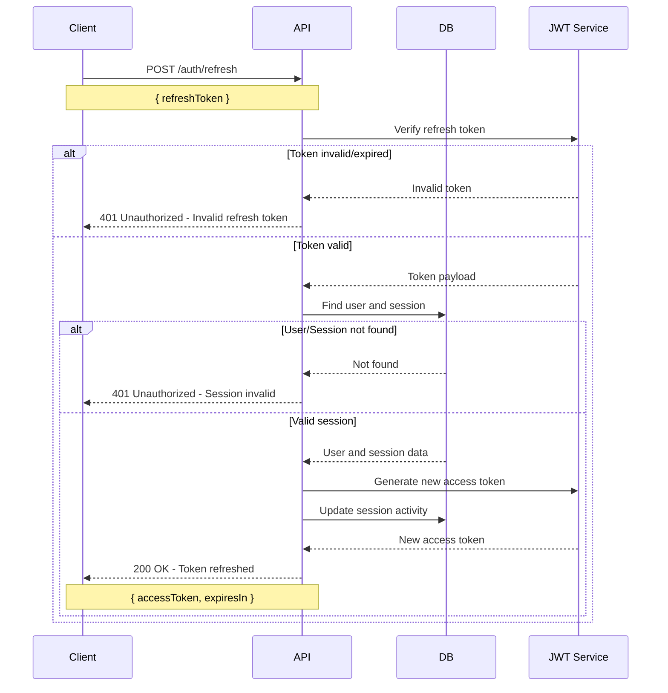

### Token Refresh Details
- **Route**: `POST /auth/refresh`
- **Purpose**: Get new access token without re-login
- **Security**: Validates refresh token and active session

## 🔐 5. Protected Route Access

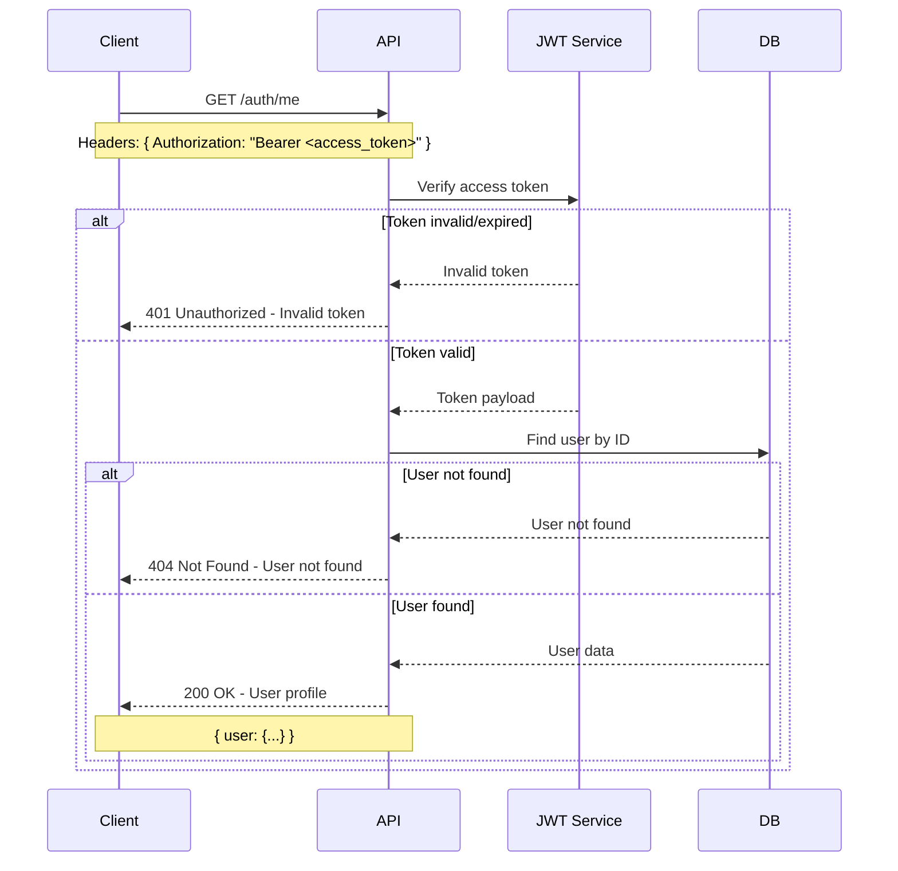

## 🔒 6. Password Reset Flow

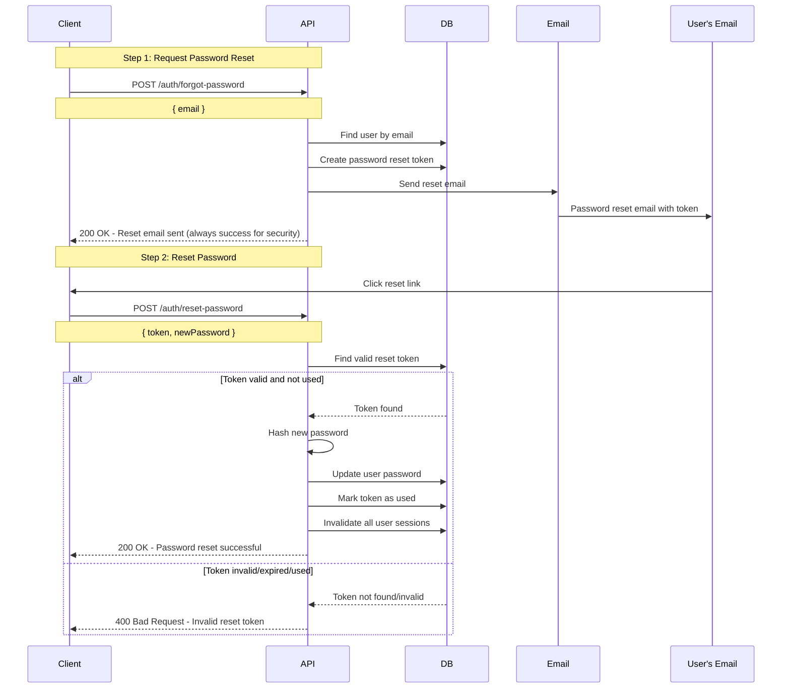

### Password Reset Details
- **Routes**: 
  - `POST /auth/forgot-password` - Request reset
  - `POST /auth/reset-password` - Complete reset
- **Token Expiry**: 1 hour
- **Security**: One-time use, all sessions invalidated after reset

## 🚪 7. Logout Flows

### Single Device Logout
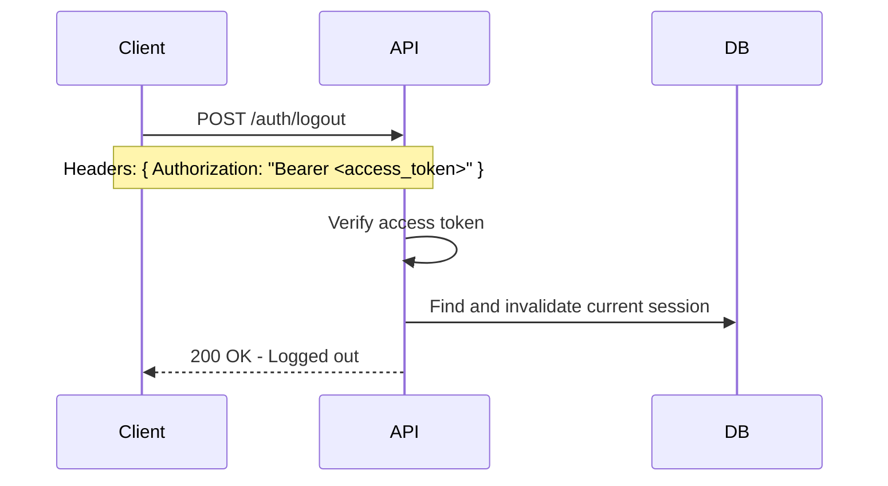

### All Devices Logout
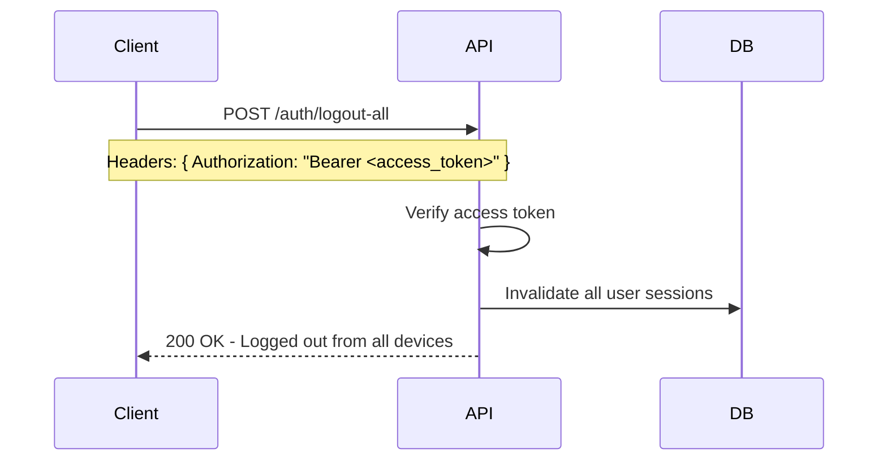

## 🔄 8. Complete User Journey Example

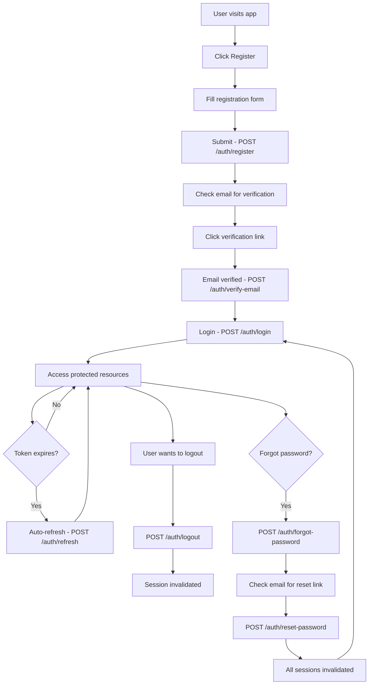

## 🛡️ Security Features

### 1. **Token Security**
- Access tokens: Short-lived (15 minutes)
- Refresh tokens: Longer-lived (7 days)
- JWT signing with secure secrets
- Token rotation on refresh

### 2. **Session Management**
- Database-stored sessions
- Session invalidation on logout
- Automatic cleanup of expired sessions
- IP address and user agent tracking

### 3. **Password Security**
- bcrypt hashing with salt rounds
- Password strength validation
- Secure password reset flow
- All sessions invalidated on password change

### 4. **Email Security**
- Time-limited verification tokens
- One-time use tokens
- Automatic token cleanup
- Secure reset flow (no user enumeration)

### 5. **Rate Limiting** (Configurable)
- Login attempt limiting
- Registration rate limiting
- Password reset rate limiting

## 📱 API Endpoints Summary

| Endpoint | Method | Purpose | Auth Required |
|----------|--------|---------|---------------|
| `/auth/register` | POST | User registration | ❌ |
| `/auth/login` | POST | User login | ❌ |
| `/auth/verify-email` | POST | Email verification | ❌ |
| `/auth/resend-verification` | POST | Resend verification email | ❌ |
| `/auth/forgot-password` | POST | Request password reset | ❌ |
| `/auth/reset-password` | POST | Complete password reset | ❌ |
| `/auth/refresh` | POST | Refresh access token | ❌ |
| `/auth/me` | GET | Get user profile | ✅ |
| `/auth/logout` | POST | Logout current session | ✅ |
| `/auth/logout-all` | POST | Logout all sessions | ✅ |

## 🎯 Key Features

✅ **Complete Authentication System**  
✅ **Email Verification**  
✅ **Password Reset**  
✅ **JWT Token Management**  
✅ **Session Management**  
✅ **Security Best Practices**  
✅ **Rate Limiting Ready**  
✅ **OAuth Ready** (extensible)  

The Tamatar Auth system provides a complete, secure, and production-ready authentication solution with all modern security practices implemented.
