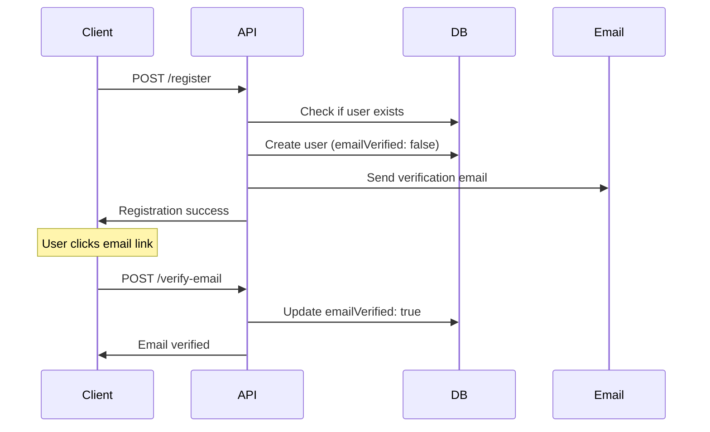
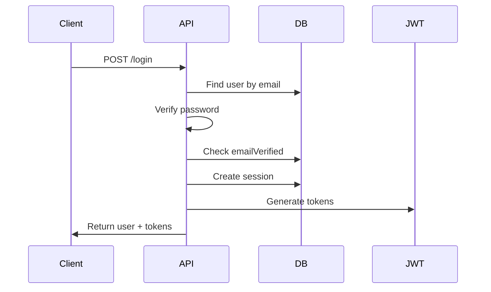
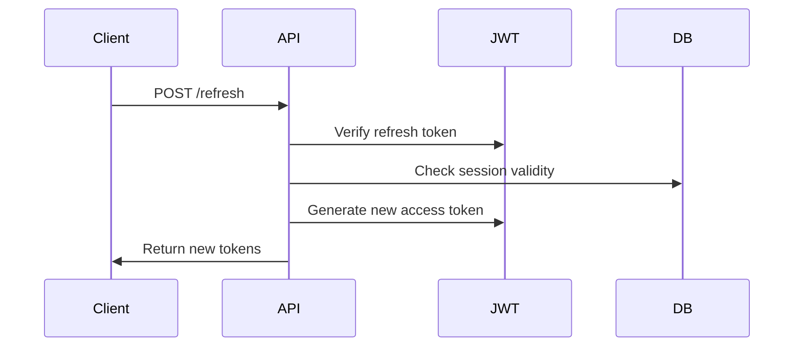

# Authentication & Authorization Guide

## Overview

This guide covers the authentication and authorization patterns implemented in Tamatar Auth, including JWT tokens, session management, OAuth integration, and security best practices.

## Authentication Flow

### 1. Registration Flow



### 2. Login Flow



### 3. Token Refresh Flow



## JWT Token Structure

### Access Token

```json
{
  "header": {
    "alg": "HS256",
    "typ": "JWT"
  },
  "payload": {
    "sub": "clw1234567890",        // User ID
    "email": "user@example.com",   // User email
    "username": "johndoe",         // Username
    "sessionId": "ses_123456",     // Session ID
    "iat": 1640995200,            // Issued at
    "exp": 1641600000,            // Expires at
    "iss": "tamatar-auth",        // Issuer
    "aud": "tamatar-services"     // Audience
  }
}
```

### Refresh Token

```json
{
  "header": {
    "alg": "HS256",
    "typ": "JWT"
  },
  "payload": {
    "sub": "clw1234567890",        // User ID
    "sessionId": "ses_123456",     // Session ID
    "type": "refresh",             // Token type
    "iat": 1640995200,            // Issued at
    "exp": 1643587200,            // Expires at (longer than access)
    "iss": "tamatar-auth",        // Issuer
    "aud": "tamatar-services"     // Audience
  }
}
```

## Implementation

### JWT Service

```typescript
// src/lib/auth/jwt.ts
import jwt from 'jsonwebtoken';
import type { User, Session } from '@prisma/client';

interface TokenPayload {
  sub: string;
  email: string;
  username: string;
  sessionId: string;
  iat?: number;
  exp?: number;
  iss: string;
  aud: string;
}

interface RefreshTokenPayload {
  sub: string;
  sessionId: string;
  type: 'refresh';
  iat?: number;
  exp?: number;
  iss: string;
  aud: string;
}

export class JWTService {
  private readonly secret: string;
  private readonly issuer = 'tamatar-auth';
  private readonly audience = 'tamatar-services';
  private readonly accessTokenExpiry = '15m';
  private readonly refreshTokenExpiry = '7d';

  constructor() {
    this.secret = process.env.JWT_SECRET!;
    if (!this.secret) {
      throw new Error('JWT_SECRET environment variable is required');
    }
  }

  generateTokens(user: User, session: Session) {
    const accessToken = this.generateAccessToken(user, session);
    const refreshToken = this.generateRefreshToken(user, session);

    return {
      accessToken,
      refreshToken,
      expiresIn: this.getExpiryInSeconds(this.accessTokenExpiry),
    };
  }

  private generateAccessToken(user: User, session: Session): string {
    const payload: TokenPayload = {
      sub: user.id,
      email: user.email,
      username: user.username,
      sessionId: session.id,
      iss: this.issuer,
      aud: this.audience,
    };

    return jwt.sign(payload, this.secret, {
      expiresIn: this.accessTokenExpiry,
    });
  }

  private generateRefreshToken(user: User, session: Session): string {
    const payload: RefreshTokenPayload = {
      sub: user.id,
      sessionId: session.id,
      type: 'refresh',
      iss: this.issuer,
      aud: this.audience,
    };

    return jwt.sign(payload, this.secret, {
      expiresIn: this.refreshTokenExpiry,
    });
  }

  verifyAccessToken(token: string): TokenPayload {
    try {
      return jwt.verify(token, this.secret, {
        issuer: this.issuer,
        audience: this.audience,
      }) as TokenPayload;
    } catch (error) {
      throw new InvalidTokenError();
    }
  }

  verifyRefreshToken(token: string): RefreshTokenPayload {
    try {
      const payload = jwt.verify(token, this.secret, {
        issuer: this.issuer,
        audience: this.audience,
      }) as RefreshTokenPayload;

      if (payload.type !== 'refresh') {
        throw new InvalidTokenError();
      }

      return payload;
    } catch (error) {
      throw new InvalidTokenError();
    }
  }

  private getExpiryInSeconds(expiry: string): number {
    const match = expiry.match(/^(\d+)([smhd])$/);
    if (!match) return 0;

    const [, value, unit] = match;
    const multipliers = { s: 1, m: 60, h: 3600, d: 86400 };
    return parseInt(value) * multipliers[unit as keyof typeof multipliers];
  }
}

export const jwtService = new JWTService();
```

### Authentication Middleware

```typescript
// src/lib/middleware/auth.ts
import type { Context } from 'elysia';
import { jwtService } from '../auth/jwt';
import { sessionService } from '../auth/session';
import { 
  MissingTokenError, 
  InvalidTokenError, 
  TokenExpiredError 
} from '../errors';

export interface AuthenticatedContext extends Context {
  user: {
    id: string;
    email: string;
    username: string;
    sessionId: string;
  };
}

export const authMiddleware = async (ctx: Context): Promise<AuthenticatedContext> => {
  const authorization = ctx.headers.authorization;
  
  if (!authorization) {
    throw new MissingTokenError();
  }

  const [scheme, token] = authorization.split(' ');
  
  if (scheme !== 'Bearer' || !token) {
    throw new InvalidTokenError();
  }

  try {
    // Verify JWT token
    const payload = jwtService.verifyAccessToken(token);
    
    // Verify session is still valid
    const session = await sessionService.validateSession(payload.sessionId);
    
    if (!session || !session.isValid) {
      throw new InvalidTokenError();
    }

    // Update session last activity
    await sessionService.updateLastActivity(session.id);

    return {
      ...ctx,
      user: {
        id: payload.sub,
        email: payload.email,
        username: payload.username,
        sessionId: payload.sessionId,
      },
    };
  } catch (error) {
    if (error.name === 'TokenExpiredError') {
      throw new TokenExpiredError();
    }
    throw new InvalidTokenError();
  }
};

// Optional authentication (user may or may not be authenticated)
export const optionalAuthMiddleware = async (ctx: Context) => {
  try {
    return await authMiddleware(ctx);
  } catch (error) {
    // If authentication fails, continue without user context
    return ctx;
  }
};
```

### Session Management

```typescript
// src/lib/auth/session.ts
import { prisma } from '../db/prisma';
import type { Session, User } from '@prisma/client';

export class SessionService {
  async createSession(
    userId: string, 
    userAgent?: string, 
    ipAddress?: string
  ): Promise<Session> {
    // Calculate expiry date (7 days from now)
    const expiresAt = new Date();
    expiresAt.setDate(expiresAt.getDate() + 7);

    return await prisma.session.create({
      data: {
        userId,
        userAgent,
        ipAddress,
        expiresAt,
      },
    });
  }

  async validateSession(sessionId: string): Promise<Session | null> {
    const session = await prisma.session.findUnique({
      where: { id: sessionId },
    });

    if (!session) return null;

    // Check if session is expired
    if (session.expiresAt < new Date()) {
      await this.invalidateSession(sessionId);
      return null;
    }

    return session.isValid ? session : null;
  }

  async invalidateSession(sessionId: string): Promise<void> {
    await prisma.session.update({
      where: { id: sessionId },
      data: { isValid: false },
    });
  }

  async invalidateAllUserSessions(
    userId: string, 
    excludeSessionId?: string
  ): Promise<number> {
    const result = await prisma.session.updateMany({
      where: {
        userId,
        isValid: true,
        ...(excludeSessionId && { id: { not: excludeSessionId } }),
      },
      data: { isValid: false },
    });

    return result.count;
  }

  async getUserSessions(userId: string): Promise<Session[]> {
    return await prisma.session.findMany({
      where: {
        userId,
        isValid: true,
        expiresAt: { gt: new Date() },
      },
      orderBy: { createdAt: 'desc' },
    });
  }

  async updateLastActivity(sessionId: string): Promise<void> {
    await prisma.session.update({
      where: { id: sessionId },
      data: { updatedAt: new Date() },
    });
  }

  async cleanupExpiredSessions(): Promise<number> {
    const result = await prisma.session.deleteMany({
      where: {
        OR: [
          { expiresAt: { lt: new Date() } },
          { isValid: false },
        ],
      },
    });

    return result.count;
  }
}

export const sessionService = new SessionService();
```

## Authorization Patterns

### Role-Based Access Control (RBAC)

```typescript
// src/lib/auth/rbac.ts
export enum Role {
  USER = 'user',
  MODERATOR = 'moderator',
  ADMIN = 'admin',
  SUPER_ADMIN = 'super_admin',
}

export enum Permission {
  // User permissions
  READ_PROFILE = 'read:profile',
  UPDATE_PROFILE = 'update:profile',
  DELETE_ACCOUNT = 'delete:account',
  
  // Content permissions
  CREATE_CONTENT = 'create:content',
  UPDATE_CONTENT = 'update:content',
  DELETE_CONTENT = 'delete:content',
  MODERATE_CONTENT = 'moderate:content',
  
  // Admin permissions
  MANAGE_USERS = 'manage:users',
  MANAGE_ROLES = 'manage:roles',
  VIEW_ANALYTICS = 'view:analytics',
  SYSTEM_ADMIN = 'system:admin',
}

const rolePermissions: Record<Role, Permission[]> = {
  [Role.USER]: [
    Permission.READ_PROFILE,
    Permission.UPDATE_PROFILE,
    Permission.DELETE_ACCOUNT,
    Permission.CREATE_CONTENT,
    Permission.UPDATE_CONTENT,
    Permission.DELETE_CONTENT,
  ],
  [Role.MODERATOR]: [
    ...rolePermissions[Role.USER],
    Permission.MODERATE_CONTENT,
  ],
  [Role.ADMIN]: [
    ...rolePermissions[Role.MODERATOR],
    Permission.MANAGE_USERS,
    Permission.VIEW_ANALYTICS,
  ],
  [Role.SUPER_ADMIN]: [
    ...rolePermissions[Role.ADMIN],
    Permission.MANAGE_ROLES,
    Permission.SYSTEM_ADMIN,
  ],
};

export class AuthorizationService {
  hasPermission(userRole: Role, permission: Permission): boolean {
    const permissions = rolePermissions[userRole] || [];
    return permissions.includes(permission);
  }

  hasAnyPermission(userRole: Role, permissions: Permission[]): boolean {
    return permissions.some(permission => 
      this.hasPermission(userRole, permission)
    );
  }

  hasAllPermissions(userRole: Role, permissions: Permission[]): boolean {
    return permissions.every(permission => 
      this.hasPermission(userRole, permission)
    );
  }

  canAccessResource(
    userRole: Role, 
    resourceOwnerId: string, 
    currentUserId: string,
    permission: Permission
  ): boolean {
    // Resource owner can always access their own resources
    if (resourceOwnerId === currentUserId) {
      return this.hasPermission(userRole, permission);
    }

    // Check if user has elevated permissions for others' resources
    const elevatedPermissions = [
      Permission.MODERATE_CONTENT,
      Permission.MANAGE_USERS,
      Permission.SYSTEM_ADMIN,
    ];

    return this.hasAnyPermission(userRole, elevatedPermissions);
  }
}

export const authorizationService = new AuthorizationService();
```

### Authorization Middleware

```typescript
// src/lib/middleware/authorize.ts
import type { AuthenticatedContext } from './auth';
import { Permission, authorizationService } from '../auth/rbac';
import { InsufficientPermissionsError } from '../errors';

export const requirePermission = (permission: Permission) => {
  return (ctx: AuthenticatedContext) => {
    const userRole = ctx.user.role; // Assuming role is added to user context
    
    if (!authorizationService.hasPermission(userRole, permission)) {
      throw new InsufficientPermissionsError(permission);
    }

    return ctx;
  };
};

export const requireAnyPermission = (permissions: Permission[]) => {
  return (ctx: AuthenticatedContext) => {
    const userRole = ctx.user.role;
    
    if (!authorizationService.hasAnyPermission(userRole, permissions)) {
      throw new InsufficientPermissionsError(permissions.join(', '));
    }

    return ctx;
  };
};

export const requireResourceOwnership = (
  getResourceOwnerId: (ctx: AuthenticatedContext) => string,
  permission: Permission
) => {
  return (ctx: AuthenticatedContext) => {
    const resourceOwnerId = getResourceOwnerId(ctx);
    const userRole = ctx.user.role;
    const currentUserId = ctx.user.id;

    if (!authorizationService.canAccessResource(
      userRole, 
      resourceOwnerId, 
      currentUserId, 
      permission
    )) {
      throw new ResourceAccessDeniedError('Insufficient permissions for this resource');
    }

    return ctx;
  };
};
```

## OAuth Integration

### Google OAuth Setup

```typescript
// src/lib/auth/oauth.ts
import { google } from 'googleapis';

export class GoogleOAuthService {
  private oauth2Client: any;

  constructor() {
    this.oauth2Client = new google.auth.OAuth2(
      process.env.GOOGLE_CLIENT_ID,
      process.env.GOOGLE_CLIENT_SECRET,
      process.env.GOOGLE_REDIRECT_URI
    );
  }

  getAuthUrl(state: string): string {
    const scopes = [
      'https://www.googleapis.com/auth/userinfo.email',
      'https://www.googleapis.com/auth/userinfo.profile',
    ];

    return this.oauth2Client.generateAuthUrl({
      access_type: 'offline',
      scope: scopes,
      state,
    });
  }

  async handleCallback(code: string) {
    const { tokens } = await this.oauth2Client.getToken(code);
    this.oauth2Client.setCredentials(tokens);

    const oauth2 = google.oauth2({ version: 'v2', auth: this.oauth2Client });
    const { data } = await oauth2.userinfo.get();

    return {
      googleId: data.id,
      email: data.email,
      firstName: data.given_name,
      lastName: data.family_name,
      avatar: data.picture,
      emailVerified: data.verified_email,
    };
  }
}

export const googleOAuthService = new GoogleOAuthService();
```

### OAuth Routes

```typescript
// src/routes/oauth.ts
import { Elysia } from 'elysia';
import { googleOAuthService } from '../lib/auth/oauth';
import { userService } from '../lib/db/user';
import { sessionService } from '../lib/auth/session';
import { jwtService } from '../lib/auth/jwt';

export const oauthRoutes = new Elysia({ prefix: '/oauth' })
  .get('/google', ({ query, set }) => {
    const state = generateState(); // CSRF protection
    const authUrl = googleOAuthService.getAuthUrl(state);
    
    // Store state in cookie for verification
    set.cookie = {
      oauth_state: {
        value: state,
        httpOnly: true,
        secure: true,
        maxAge: 600, // 10 minutes
      },
    };

    set.redirect = authUrl;
  })
  .get('/google/callback', async ({ query, cookie, headers, set }) => {
    const { code, state } = query;
    
    // Verify state parameter
    if (!state || state !== cookie.oauth_state) {
      throw new OAuthError('Invalid state parameter');
    }

    try {
      const googleUser = await googleOAuthService.handleCallback(code);
      
      // Find existing user or create new one
      let user = await userService.findByGoogleId(googleUser.googleId);
      let isNewUser = false;

      if (!user) {
        // Check if user exists with same email
        user = await userService.findByEmail(googleUser.email);
        
        if (user) {
          // Link Google account to existing user
          await userService.linkGoogleAccount(user.id, googleUser.googleId);
        } else {
          // Create new user
          user = await userService.createFromOAuth(googleUser);
          isNewUser = true;
        }
      }

      // Create session
      const session = await sessionService.createSession(
        user.id,
        headers['user-agent'],
        headers['x-forwarded-for']
      );

      // Generate tokens
      const tokens = jwtService.generateTokens(user, session);

      return {
        data: {
          user: userService.sanitizeUser(user),
          tokens,
          isNewUser,
        },
      };
    } catch (error) {
      throw new OAuthError('Authentication failed');
    }
  });

function generateState(): string {
  return Buffer.from(crypto.randomBytes(32)).toString('base64url');
}
```

## Security Best Practices

### 1. Token Security

```typescript
// Secure JWT configuration
const jwtConfig = {
  algorithm: 'HS256',
  issuer: 'tamatar-auth',
  audience: 'tamatar-services',
  
  // Short-lived access tokens
  accessTokenExpiry: '15m',
  
  // Longer-lived refresh tokens
  refreshTokenExpiry: '7d',
  
  // Strong secret key (256-bit minimum)
  secret: process.env.JWT_SECRET, // Must be cryptographically secure
};
```

### 2. Password Security

```typescript
// src/lib/auth/password.ts
import bcrypt from 'bcryptjs';

export class PasswordService {
  private readonly saltRounds = 12;

  async hash(password: string): Promise<string> {
    return await bcrypt.hash(password, this.saltRounds);
  }

  async verify(password: string, hash: string): Promise<boolean> {
    return await bcrypt.compare(password, hash);
  }

  validate(password: string): boolean {
    // Minimum 8 characters
    if (password.length < 8) return false;
    
    // Must contain uppercase letter
    if (!/[A-Z]/.test(password)) return false;
    
    // Must contain lowercase letter
    if (!/[a-z]/.test(password)) return false;
    
    // Must contain number
    if (!/\d/.test(password)) return false;
    
    // Must contain special character
    if (!/[!@#$%^&*(),.?":{}|<>]/.test(password)) return false;
    
    return true;
  }

  generateSecure(length: number = 16): string {
    const charset = 'abcdefghijklmnopqrstuvwxyzABCDEFGHIJKLMNOPQRSTUVWXYZ0123456789!@#$%^&*';
    let password = '';
    
    for (let i = 0; i < length; i++) {
      password += charset.charAt(Math.floor(Math.random() * charset.length));
    }
    
    return password;
  }
}

export const passwordService = new PasswordService();
```

### 3. Rate Limiting

```typescript
// src/lib/middleware/rate-limit.ts
interface RateLimit {
  windowMs: number;
  maxRequests: number;
  keyGenerator?: (ctx: Context) => string;
}

const rateLimitStore = new Map<string, { count: number; resetTime: number }>();

export const rateLimit = (config: RateLimit) => {
  return (ctx: Context) => {
    const key = config.keyGenerator ? 
      config.keyGenerator(ctx) : 
      ctx.request.headers.get('x-forwarded-for') || 'unknown';
    
    const now = Date.now();
    const windowStart = now - config.windowMs;
    
    let record = rateLimitStore.get(key);
    
    if (!record || record.resetTime < windowStart) {
      record = { count: 1, resetTime: now + config.windowMs };
      rateLimitStore.set(key, record);
    } else {
      record.count++;
    }
    
    if (record.count > config.maxRequests) {
      throw new RateLimitExceededError();
    }
    
    return ctx;
  };
};

// Usage in routes
export const authRoutes = new Elysia()
  .use(rateLimit({
    windowMs: 15 * 60 * 1000, // 15 minutes
    maxRequests: 5,
    keyGenerator: (ctx) => ctx.body.email, // Rate limit by email for login
  }))
  .post('/login', loginHandler);
```

### 4. CSRF Protection

```typescript
// src/lib/middleware/csrf.ts
export const csrfProtection = (ctx: Context) => {
  const token = ctx.headers['x-csrf-token'];
  const cookieToken = ctx.cookie.csrf_token;
  
  if (!token || !cookieToken || token !== cookieToken) {
    throw new CSRFError();
  }
  
  return ctx;
};
```

## Usage Examples

### Protected Route

```typescript
// src/routes/profile.ts
import { Elysia } from 'elysia';
import { authMiddleware, requirePermission } from '../lib/middleware';
import { Permission } from '../lib/auth/rbac';

export const profileRoutes = new Elysia({ prefix: '/profile' })
  .derive(authMiddleware)
  .derive(requirePermission(Permission.READ_PROFILE))
  .get('/', ({ user }) => {
    return {
      data: {
        user: {
          id: user.id,
          email: user.email,
          username: user.username,
        },
      },
    };
  })
  .derive(requirePermission(Permission.UPDATE_PROFILE))
  .patch('/', ({ user, body }) => {
    // Update user profile
  });
```

### Service-to-Service Authentication

```typescript
// src/lib/auth/service.ts
export class ServiceAuthService {
  private readonly serviceSecrets = new Map([
    ['user-service', process.env.USER_SERVICE_SECRET],
    ['content-service', process.env.CONTENT_SERVICE_SECRET],
    ['notification-service', process.env.NOTIFICATION_SERVICE_SECRET],
  ]);

  validateServiceToken(serviceName: string, token: string): boolean {
    const secret = this.serviceSecrets.get(serviceName);
    return secret && token === secret;
  }

  generateServiceToken(serviceName: string): string {
    // Generate HMAC-based token for service-to-service communication
    return crypto
      .createHmac('sha256', this.serviceSecrets.get(serviceName)!)
      .update(`${serviceName}:${Date.now()}`)
      .digest('hex');
  }
}
```

This comprehensive authentication and authorization system provides secure, scalable user management with support for multiple authentication methods and fine-grained access control.
