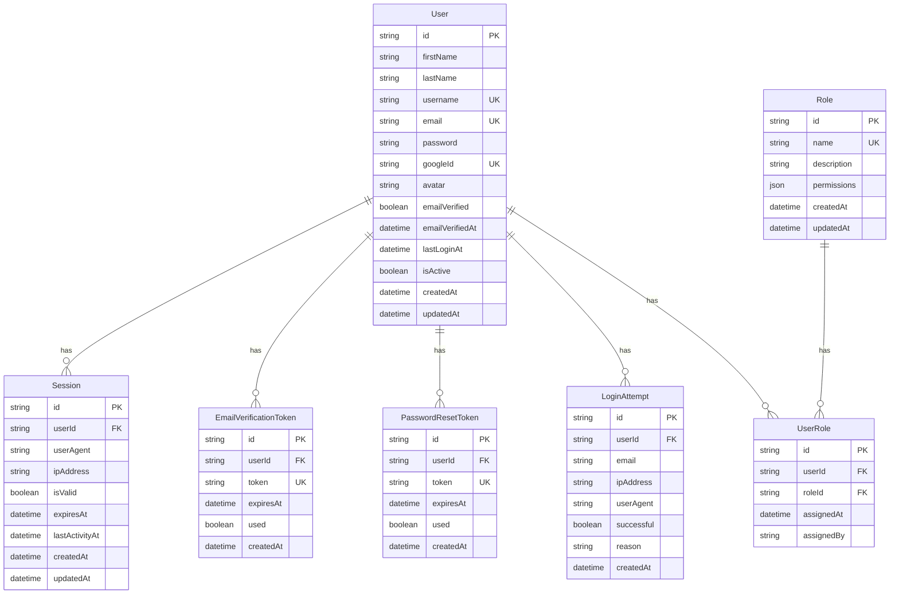

# Database Design

## Overview

The Tamatar Auth database is designed for scalability, performance, and security. It uses PostgreSQL with Prisma ORM for type-safe database operations and automatic migrations.

## Database Schema

### Entity Relationship Diagram



## Schema Definition

### Complete Prisma Schema

```prisma
// prisma/schema.prisma
generator client {
  provider = "prisma-client-js"
  output   = "../src/generated/prisma"
}

generator prismabox {
  provider = "prismabox"
  typeboxImportDependencyName = "elysia"
  typeboxImportVariableName = "t"
  inputModel = true
  output   = "../src/generated/prismabox"
}

datasource db {
  provider = "postgresql"
  url      = env("DATABASE_URL")
}

model User {
  id                String   @id @default(cuid())
  firstName         String   @db.VarChar(50)
  lastName          String?  @db.VarChar(50)
  username          String   @unique @db.VarChar(30)
  email             String   @unique @db.VarChar(255)
  password          String?  @db.VarChar(255)
  googleId          String?  @unique @db.VarChar(255)
  avatar            String?  @db.VarChar(500)
  emailVerified     Boolean  @default(false)
  emailVerifiedAt   DateTime?
  lastLoginAt       DateTime?
  isActive          Boolean  @default(true)
  createdAt         DateTime @default(now())
  updatedAt         DateTime @updatedAt

  // Relations
  sessions              Session[]
  emailVerificationTokens EmailVerificationToken[]
  passwordResetTokens   PasswordResetToken[]
  loginAttempts         LoginAttempt[]
  userRoles             UserRole[]

  @@map("users")
  @@index([email], name: "idx_users_email")
  @@index([username], name: "idx_users_username")
  @@index([googleId], name: "idx_users_google_id")
  @@index([emailVerified], name: "idx_users_email_verified")
  @@index([isActive], name: "idx_users_is_active")
  @@index([createdAt], name: "idx_users_created_at")
}

model Session {
  id             String   @id @default(cuid())
  userId         String
  userAgent      String?  @db.VarChar(500)
  ipAddress      String?  @db.VarChar(45)
  isValid        Boolean  @default(true)
  expiresAt      DateTime
  lastActivityAt DateTime @default(now())
  createdAt      DateTime @default(now())
  updatedAt      DateTime @updatedAt

  // Relations
  user User @relation(fields: [userId], references: [id], onDelete: Cascade)

  @@map("sessions")
  @@index([userId], name: "idx_sessions_user_id")
  @@index([expiresAt], name: "idx_sessions_expires_at")
  @@index([isValid], name: "idx_sessions_is_valid")
  @@index([lastActivityAt], name: "idx_sessions_last_activity")
}

model EmailVerificationToken {
  id        String   @id @default(cuid())
  userId    String
  token     String   @unique @db.VarChar(255)
  expiresAt DateTime
  used      Boolean  @default(false)
  createdAt DateTime @default(now())

  // Relations
  user User @relation(fields: [userId], references: [id], onDelete: Cascade)

  @@map("email_verification_tokens")
  @@index([userId], name: "idx_email_verification_tokens_user_id")
  @@index([token], name: "idx_email_verification_tokens_token")
  @@index([expiresAt], name: "idx_email_verification_tokens_expires_at")
}

model PasswordResetToken {
  id        String   @id @default(cuid())
  userId    String
  token     String   @unique @db.VarChar(255)
  expiresAt DateTime
  used      Boolean  @default(false)
  createdAt DateTime @default(now())

  // Relations
  user User @relation(fields: [userId], references: [id], onDelete: Cascade)

  @@map("password_reset_tokens")
  @@index([userId], name: "idx_password_reset_tokens_user_id")
  @@index([token], name: "idx_password_reset_tokens_token")
  @@index([expiresAt], name: "idx_password_reset_tokens_expires_at")
}

model LoginAttempt {
  id         String   @id @default(cuid())
  userId     String?
  email      String   @db.VarChar(255)
  ipAddress  String?  @db.VarChar(45)
  userAgent  String?  @db.VarChar(500)
  successful Boolean
  reason     String?  @db.VarChar(255)
  createdAt  DateTime @default(now())

  // Relations
  user User? @relation(fields: [userId], references: [id], onDelete: SetNull)

  @@map("login_attempts")
  @@index([userId], name: "idx_login_attempts_user_id")
  @@index([email], name: "idx_login_attempts_email")
  @@index([ipAddress], name: "idx_login_attempts_ip_address")
  @@index([successful], name: "idx_login_attempts_successful")
  @@index([createdAt], name: "idx_login_attempts_created_at")
}

model Role {
  id          String   @id @default(cuid())
  name        String   @unique @db.VarChar(50)
  description String?  @db.VarChar(255)
  permissions Json     @default("[]")
  createdAt   DateTime @default(now())
  updatedAt   DateTime @updatedAt

  // Relations
  userRoles UserRole[]

  @@map("roles")
  @@index([name], name: "idx_roles_name")
}

model UserRole {
  id         String   @id @default(cuid())
  userId     String
  roleId     String
  assignedAt DateTime @default(now())
  assignedBy String?

  // Relations
  user User @relation(fields: [userId], references: [id], onDelete: Cascade)
  role Role @relation(fields: [roleId], references: [id], onDelete: Cascade)

  @@map("user_roles")
  @@unique([userId, roleId], name: "unique_user_role")
  @@index([userId], name: "idx_user_roles_user_id")
  @@index([roleId], name: "idx_user_roles_role_id")
}
```

## Table Details

### Users Table

**Purpose**: Store user account information and authentication data.

**Key Features**:
- CUID primary keys for security and performance
- Unique constraints on email, username, and googleId
- Nullable password for OAuth-only accounts
- Email verification tracking
- Soft delete support via isActive flag

**Indexes**:
- Primary key on `id`
- Unique indexes on `email`, `username`, `googleId`
- Performance indexes on `emailVerified`, `isActive`, `createdAt`

### Sessions Table

**Purpose**: Track user sessions for authentication and security.

**Key Features**:
- Links to users with cascade delete
- Stores user agent and IP for security tracking
- Session validity and expiration management
- Last activity tracking for session cleanup

**Indexes**:
- Foreign key index on `userId`
- Performance indexes on `expiresAt`, `isValid`, `lastActivityAt`

### Email Verification Tokens

**Purpose**: Manage email verification process.

**Key Features**:
- Secure token generation and storage
- Expiration handling
- One-time use enforcement
- Cascade delete with user

### Password Reset Tokens

**Purpose**: Handle secure password reset functionality.

**Key Features**:
- Time-limited tokens
- One-time use verification
- Secure token generation
- Automatic cleanup

### Login Attempts

**Purpose**: Security monitoring and rate limiting.

**Key Features**:
- Track both successful and failed attempts
- Store IP and user agent for analysis
- Support for audit trails
- Nullable userId for pre-authentication tracking

### Roles and User Roles

**Purpose**: Role-based access control (RBAC) system.

**Key Features**:
- Flexible permission storage as JSON
- Many-to-many relationship between users and roles
- Assignment tracking and auditing
- Cascade delete protection

## Database Utilities

### Database Connection

```typescript
// src/lib/db/prisma.ts
import { PrismaClient } from '../../generated/prisma';

class DatabaseService {
  private static instance: PrismaClient;

  static getInstance(): PrismaClient {
    if (!DatabaseService.instance) {
      DatabaseService.instance = new PrismaClient({
        log: process.env.NODE_ENV === 'development' 
          ? ['query', 'info', 'warn', 'error']
          : ['error'],
        errorFormat: 'colorless',
      });

      // Graceful shutdown
      process.on('beforeExit', async () => {
        await DatabaseService.instance.$disconnect();
      });
    }

    return DatabaseService.instance;
  }

  static async healthCheck(): Promise<boolean> {
    try {
      await DatabaseService.getInstance().$queryRaw`SELECT 1`;
      return true;
    } catch (error) {
      return false;
    }
  }
}

export const prisma = DatabaseService.getInstance();
export { DatabaseService };
```

### User Repository

```typescript
// src/lib/db/repositories/user.ts
import { prisma } from '../prisma';
import type { User, Prisma } from '../../../generated/prisma';

export class UserRepository {
  async create(data: Prisma.UserCreateInput): Promise<User> {
    return await prisma.user.create({
      data,
    });
  }

  async findById(id: string): Promise<User | null> {
    return await prisma.user.findUnique({
      where: { id },
      include: {
        userRoles: {
          include: {
            role: true,
          },
        },
      },
    });
  }

  async findByEmail(email: string): Promise<User | null> {
    return await prisma.user.findUnique({
      where: { email },
    });
  }

  async findByUsername(username: string): Promise<User | null> {
    return await prisma.user.findUnique({
      where: { username },
    });
  }

  async findByGoogleId(googleId: string): Promise<User | null> {
    return await prisma.user.findUnique({
      where: { googleId },
    });
  }

  async update(id: string, data: Prisma.UserUpdateInput): Promise<User> {
    return await prisma.user.update({
      where: { id },
      data,
    });
  }

  async delete(id: string): Promise<User> {
    // Soft delete
    return await prisma.user.update({
      where: { id },
      data: { isActive: false },
    });
  }

  async hardDelete(id: string): Promise<User> {
    return await prisma.user.delete({
      where: { id },
    });
  }

  async verifyEmail(id: string): Promise<User> {
    return await prisma.user.update({
      where: { id },
      data: {
        emailVerified: true,
        emailVerifiedAt: new Date(),
      },
    });
  }

  async updateLastLogin(id: string): Promise<User> {
    return await prisma.user.update({
      where: { id },
      data: { lastLoginAt: new Date() },
    });
  }

  async findMany(params: {
    skip?: number;
    take?: number;
    where?: Prisma.UserWhereInput;
    orderBy?: Prisma.UserOrderByWithRelationInput;
  }): Promise<User[]> {
    return await prisma.user.findMany(params);
  }

  async count(where?: Prisma.UserWhereInput): Promise<number> {
    return await prisma.user.count({ where });
  }
}

export const userRepository = new UserRepository();
```

### Session Repository

```typescript
// src/lib/db/repositories/session.ts
import { prisma } from '../prisma';
import type { Session, Prisma } from '../../../generated/prisma';

export class SessionRepository {
  async create(data: Prisma.SessionCreateInput): Promise<Session> {
    return await prisma.session.create({
      data,
    });
  }

  async findById(id: string): Promise<Session | null> {
    return await prisma.session.findUnique({
      where: { id },
      include: {
        user: true,
      },
    });
  }

  async findByUserId(userId: string): Promise<Session[]> {
    return await prisma.session.findMany({
      where: {
        userId,
        isValid: true,
        expiresAt: { gt: new Date() },
      },
      orderBy: { lastActivityAt: 'desc' },
    });
  }

  async update(id: string, data: Prisma.SessionUpdateInput): Promise<Session> {
    return await prisma.session.update({
      where: { id },
      data,
    });
  }

  async invalidate(id: string): Promise<Session> {
    return await prisma.session.update({
      where: { id },
      data: { isValid: false },
    });
  }

  async invalidateAllUserSessions(
    userId: string, 
    excludeSessionId?: string
  ): Promise<Prisma.BatchPayload> {
    return await prisma.session.updateMany({
      where: {
        userId,
        isValid: true,
        ...(excludeSessionId && { id: { not: excludeSessionId } }),
      },
      data: { isValid: false },
    });
  }

  async cleanupExpired(): Promise<Prisma.BatchPayload> {
    return await prisma.session.deleteMany({
      where: {
        OR: [
          { expiresAt: { lt: new Date() } },
          { isValid: false },
        ],
      },
    });
  }

  async updateLastActivity(id: string): Promise<Session> {
    return await prisma.session.update({
      where: { id },
      data: { lastActivityAt: new Date() },
    });
  }
}

export const sessionRepository = new SessionRepository();
```

## Database Migrations

### Initial Migration

```sql
-- 20240629_init/migration.sql
-- CreateEnum
CREATE TYPE "Role" AS ENUM ('USER', 'MODERATOR', 'ADMIN', 'SUPER_ADMIN');

-- CreateTable
CREATE TABLE "users" (
    "id" TEXT NOT NULL,
    "firstName" VARCHAR(50) NOT NULL,
    "lastName" VARCHAR(50),
    "username" VARCHAR(30) NOT NULL,
    "email" VARCHAR(255) NOT NULL,
    "password" VARCHAR(255),
    "googleId" VARCHAR(255),
    "avatar" VARCHAR(500),
    "emailVerified" BOOLEAN NOT NULL DEFAULT false,
    "emailVerifiedAt" TIMESTAMP(3),
    "lastLoginAt" TIMESTAMP(3),
    "isActive" BOOLEAN NOT NULL DEFAULT true,
    "createdAt" TIMESTAMP(3) NOT NULL DEFAULT CURRENT_TIMESTAMP,
    "updatedAt" TIMESTAMP(3) NOT NULL,

    CONSTRAINT "users_pkey" PRIMARY KEY ("id")
);

-- CreateTable
CREATE TABLE "sessions" (
    "id" TEXT NOT NULL,
    "userId" TEXT NOT NULL,
    "userAgent" VARCHAR(500),
    "ipAddress" VARCHAR(45),
    "isValid" BOOLEAN NOT NULL DEFAULT true,
    "expiresAt" TIMESTAMP(3) NOT NULL,
    "lastActivityAt" TIMESTAMP(3) NOT NULL DEFAULT CURRENT_TIMESTAMP,
    "createdAt" TIMESTAMP(3) NOT NULL DEFAULT CURRENT_TIMESTAMP,
    "updatedAt" TIMESTAMP(3) NOT NULL,

    CONSTRAINT "sessions_pkey" PRIMARY KEY ("id")
);

-- Additional tables...

-- CreateIndex
CREATE UNIQUE INDEX "users_username_key" ON "users"("username");
CREATE UNIQUE INDEX "users_email_key" ON "users"("email");
CREATE UNIQUE INDEX "users_googleId_key" ON "users"("googleId");
CREATE INDEX "idx_users_email" ON "users"("email");
-- Additional indexes...

-- AddForeignKey
ALTER TABLE "sessions" ADD CONSTRAINT "sessions_userId_fkey" 
    FOREIGN KEY ("userId") REFERENCES "users"("id") ON DELETE CASCADE ON UPDATE CASCADE;
```

### Performance Optimization Migration

```sql
-- 20240630_add_performance_indexes/migration.sql

-- Add composite indexes for common queries
CREATE INDEX "idx_sessions_user_valid_active" ON "sessions"("userId", "isValid", "expiresAt");
CREATE INDEX "idx_login_attempts_email_time" ON "login_attempts"("email", "createdAt");
CREATE INDEX "idx_users_active_email_verified" ON "users"("isActive", "emailVerified");

-- Add partial indexes for better performance
CREATE INDEX "idx_sessions_valid_unexpired" ON "sessions"("userId") 
    WHERE "isValid" = true AND "expiresAt" > CURRENT_TIMESTAMP;

CREATE INDEX "idx_tokens_unused_unexpired" ON "email_verification_tokens"("userId") 
    WHERE "used" = false AND "expiresAt" > CURRENT_TIMESTAMP;
```

## Database Maintenance

### Cleanup Scripts

```typescript
// src/lib/db/maintenance.ts
import { prisma } from './prisma';
import { logger } from '../utils/logger';

export class DatabaseMaintenance {
  static async cleanupExpiredSessions(): Promise<number> {
    const result = await prisma.session.deleteMany({
      where: {
        OR: [
          { expiresAt: { lt: new Date() } },
          { 
            isValid: false,
            updatedAt: { lt: new Date(Date.now() - 7 * 24 * 60 * 60 * 1000) } // 7 days old
          },
        ],
      },
    });

    logger.info(`Cleaned up ${result.count} expired sessions`);
    return result.count;
  }

  static async cleanupExpiredTokens(): Promise<void> {
    const emailTokensResult = await prisma.emailVerificationToken.deleteMany({
      where: {
        OR: [
          { expiresAt: { lt: new Date() } },
          { used: true },
        ],
      },
    });

    const passwordTokensResult = await prisma.passwordResetToken.deleteMany({
      where: {
        OR: [
          { expiresAt: { lt: new Date() } },
          { used: true },
        ],
      },
    });

    logger.info(`Cleaned up ${emailTokensResult.count} email verification tokens`);
    logger.info(`Cleaned up ${passwordTokensResult.count} password reset tokens`);
  }

  static async cleanupOldLoginAttempts(): Promise<number> {
    // Keep login attempts for 30 days for security analysis
    const thirtyDaysAgo = new Date(Date.now() - 30 * 24 * 60 * 60 * 1000);
    
    const result = await prisma.loginAttempt.deleteMany({
      where: {
        createdAt: { lt: thirtyDaysAgo },
      },
    });

    logger.info(`Cleaned up ${result.count} old login attempts`);
    return result.count;
  }

  static async runMaintenance(): Promise<void> {
    logger.info('Starting database maintenance...');
    
    try {
      await Promise.all([
        this.cleanupExpiredSessions(),
        this.cleanupExpiredTokens(),
        this.cleanupOldLoginAttempts(),
      ]);
      
      logger.info('Database maintenance completed successfully');
    } catch (error) {
      logger.error('Database maintenance failed', { error });
      throw error;
    }
  }
}

// Schedule maintenance (in a real app, use a job scheduler)
if (process.env.NODE_ENV === 'production') {
  setInterval(async () => {
    try {
      await DatabaseMaintenance.runMaintenance();
    } catch (error) {
      logger.error('Scheduled maintenance failed', { error });
    }
  }, 24 * 60 * 60 * 1000); // Run daily
}
```

### Health Checks

```typescript
// src/lib/db/health.ts
import { prisma } from './prisma';

export class DatabaseHealth {
  static async checkConnection(): Promise<boolean> {
    try {
      await prisma.$queryRaw`SELECT 1`;
      return true;
    } catch (error) {
      return false;
    }
  }

  static async getMetrics() {
    const [
      userCount,
      activeSessionCount,
      totalSessionCount,
      recentLoginAttempts,
    ] = await Promise.all([
      prisma.user.count({ where: { isActive: true } }),
      prisma.session.count({ 
        where: { 
          isValid: true, 
          expiresAt: { gt: new Date() } 
        } 
      }),
      prisma.session.count(),
      prisma.loginAttempt.count({
        where: {
          createdAt: { gt: new Date(Date.now() - 24 * 60 * 60 * 1000) }
        }
      }),
    ]);

    return {
      users: {
        total: userCount,
      },
      sessions: {
        active: activeSessionCount,
        total: totalSessionCount,
      },
      security: {
        recentLoginAttempts,
      },
    };
  }
}
```

## Performance Considerations

### 1. Query Optimization

- Use appropriate indexes for common query patterns
- Implement connection pooling
- Use read replicas for read-heavy operations
- Implement query result caching

### 2. Data Archival

- Archive old login attempts to separate tables
- Implement data retention policies
- Use partitioning for large tables

### 3. Monitoring

- Monitor slow queries
- Track database connection usage
- Set up alerts for unusual patterns
- Monitor disk usage and performance metrics

This database design provides a solid foundation for a scalable authentication service with proper indexing, relationships, and maintenance procedures.
