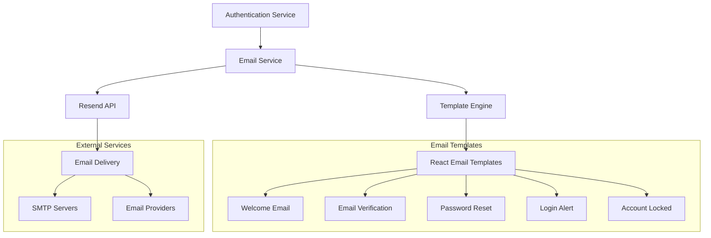

# Email Service Documentation

## Overview

The Tamatar Auth email service handles all email communications including verification emails, password resets, and notifications. Built with React Email templates and Resend for reliable delivery.

## Architecture



## Email Service Implementation

### Core Email Service

```typescript
// src/lib/email/service.ts
import type { ReactNode } from 'react';
import { Resend } from 'resend';
import { logger } from '../utils/logger';
import { EmailServiceError } from '../errors';

interface EmailOptions {
  to: string | string[];
  subject: string;
  react: ReactNode;
  from?: string;
  replyTo?: string;
  tags?: Array<{ name: string; value: string }>;
}

interface EmailResponse {
  id: string;
  messageId?: string;
}

export class EmailService {
  private resend: Resend;
  private defaultFrom: string;

  constructor() {
    const apiKey = process.env.RESEND_API_KEY;
    if (!apiKey) {
      throw new Error('RESEND_API_KEY environment variable is required');
    }

    this.resend = new Resend(apiKey);
    this.defaultFrom = process.env.FROM_EMAIL || 'Tamatar Auth <auth@email.tamatar.dev>';
  }

  async sendEmail(options: EmailOptions): Promise<EmailResponse> {
    try {
      const { data, error } = await this.resend.emails.send({
        from: options.from || this.defaultFrom,
        to: Array.isArray(options.to) ? options.to : [options.to],
        subject: options.subject,
        react: options.react,
        replyTo: options.replyTo,
        tags: options.tags,
      });

      if (error || !data) {
        logger.error('Failed to send email', { 
          error, 
          to: options.to, 
          subject: options.subject 
        });
        throw new EmailServiceError();
      }

      logger.info('Email sent successfully', {
        id: data.id,
        to: options.to,
        subject: options.subject,
      });

      return {
        id: data.id,
        messageId: data.id,
      };
    } catch (error) {
      logger.error('Email service error', { 
        error, 
        to: options.to, 
        subject: options.subject 
      });
      
      if (error instanceof EmailServiceError) {
        throw error;
      }
      
      throw new EmailServiceError();
    }
  }

  async sendBulkEmail(emails: EmailOptions[]): Promise<EmailResponse[]> {
    const results = await Promise.allSettled(
      emails.map(email => this.sendEmail(email))
    );

    const responses: EmailResponse[] = [];
    const failures: Array<{ email: EmailOptions; error: any }> = [];

    results.forEach((result, index) => {
      if (result.status === 'fulfilled') {
        responses.push(result.value);
      } else {
        failures.push({
          email: emails[index],
          error: result.reason,
        });
      }
    });

    if (failures.length > 0) {
      logger.warn('Some bulk emails failed', { failures });
    }

    return responses;
  }

  async verifyDomain(domain: string): Promise<boolean> {
    try {
      // Implementation depends on Resend API capabilities
      // This is a placeholder for domain verification
      return true;
    } catch (error) {
      logger.error('Domain verification failed', { domain, error });
      return false;
    }
  }
}

export const emailService = new EmailService();
```

### Email Templates

#### Base Template Layout

```typescript
// src/lib/email/templates/layouts/BaseLayout.tsx
import {
  Html,
  Head,
  Body,
  Container,
  Section,
  Img,
  Text,
  Link,
  Hr,
} from '@react-email/components';
import type { ReactNode } from 'react';

interface BaseLayoutProps {
  children: ReactNode;
  title: string;
}

export function BaseLayout({ children, title }: BaseLayoutProps) {
  return (
    <Html>
      <Head>
        <title>{title}</title>
      </Head>
      <Body style={styles.body}>
        <Container style={styles.container}>
          {/* Header */}
          <Section style={styles.header}>
            
          </Section>

          {/* Content */}
          <Section style={styles.content}>
            {children}
          </Section>

          {/* Footer */}
          <Section style={styles.footer}>
            <Hr style={styles.hr} />
            <Text style={styles.footerText}>
              This email was sent by Tamatar Auth Service. If you have any questions,
              please contact our support team.
            </Text>
            <Text style={styles.footerText}>
              <Link href="https://tamatar.dev/privacy" style={styles.link}>
                Privacy Policy
              </Link>
              {' • '}
              <Link href="https://tamatar.dev/terms" style={styles.link}>
                Terms of Service
              </Link>
              {' • '}
              <Link href="https://tamatar.dev/unsubscribe" style={styles.link}>
                Unsubscribe
              </Link>
            </Text>
          </Section>
        </Container>
      </Body>
    </Html>
  );
}

const styles = {
  body: {
    backgroundColor: '#ffffff',
    fontFamily: '-apple-system,BlinkMacSystemFont,"Segoe UI",Roboto,Oxygen-Sans,Ubuntu,Cantarell,"Helvetica Neue",sans-serif',
  },
  container: {
    margin: '0 auto',
    padding: '20px 0 48px',
    width: '560px',
  },
  header: {
    padding: '0 0 32px',
    textAlign: 'center' as const,
  },
  logo: {
    margin: '0 auto',
  },
  content: {
    padding: '0 0 32px',
  },
  footer: {
    padding: '32px 0 0',
  },
  hr: {
    borderColor: '#e6ebf1',
    margin: '20px 0',
  },
  footerText: {
    color: '#8898aa',
    fontSize: '12px',
    lineHeight: '16px',
    textAlign: 'center' as const,
  },
  link: {
    color: '#556cd6',
    textDecoration: 'none',
  },
};
```

#### Email Verification Template

```typescript
// src/lib/email/templates/EmailVerification.tsx
import {
  Text,
  Button,
  Section,
} from '@react-email/components';
import { BaseLayout } from './layouts/BaseLayout';

interface EmailVerificationProps {
  firstName: string;
  verificationUrl: string;
}

export function EmailVerificationTemplate({ 
  firstName, 
  verificationUrl 
}: EmailVerificationProps) {
  return (
    <BaseLayout title="Verify your email address">
      <Text style={styles.greeting}>
        Hi {firstName},
      </Text>
      
      <Text style={styles.text}>
        Thank you for creating an account with Tamatar! To complete your 
        registration and secure your account, please verify your email address.
      </Text>

      <Section style={styles.buttonContainer}>
        <Button href={verificationUrl} style={styles.button}>
          Verify Email Address
        </Button>
      </Section>

      <Text style={styles.text}>
        If the button above doesn't work, you can copy and paste this link 
        into your browser:
      </Text>
      
      <Text style={styles.url}>
        {verificationUrl}
      </Text>

      <Text style={styles.note}>
        This verification link will expire in 24 hours. If you didn't create 
        an account with us, you can safely ignore this email.
      </Text>

      <Text style={styles.signature}>
        Best regards,<br />
        The Tamatar Team
      </Text>
    </BaseLayout>
  );
}

const styles = {
  greeting: {
    fontSize: '16px',
    fontWeight: 'bold',
    margin: '0 0 16px',
  },
  text: {
    fontSize: '14px',
    lineHeight: '24px',
    margin: '0 0 16px',
    color: '#525f7f',
  },
  buttonContainer: {
    textAlign: 'center' as const,
    margin: '32px 0',
  },
  button: {
    backgroundColor: '#556cd6',
    borderRadius: '6px',
    color: '#fff',
    fontSize: '16px',
    textDecoration: 'none',
    textAlign: 'center' as const,
    display: 'inline-block',
    padding: '12px 24px',
    fontWeight: 'bold',
  },
  url: {
    fontSize: '12px',
    color: '#8898aa',
    textAlign: 'center' as const,
    wordBreak: 'break-all' as const,
    margin: '0 0 16px',
  },
  note: {
    fontSize: '12px',
    color: '#8898aa',
    margin: '32px 0 16px',
    fontStyle: 'italic',
  },
  signature: {
    fontSize: '14px',
    margin: '32px 0 0',
  },
};
```

#### Password Reset Template

```typescript
// src/lib/email/templates/PasswordReset.tsx
import {
  Text,
  Button,
  Section,
} from '@react-email/components';
import { BaseLayout } from './layouts/BaseLayout';

interface PasswordResetProps {
  firstName: string;
  resetUrl: string;
  ipAddress?: string;
  userAgent?: string;
}

export function PasswordResetTemplate({ 
  firstName, 
  resetUrl,
  ipAddress,
  userAgent 
}: PasswordResetProps) {
  return (
    <BaseLayout title="Reset your password">
      <Text style={styles.greeting}>
        Hi {firstName},
      </Text>
      
      <Text style={styles.text}>
        We received a request to reset your password for your Tamatar account. 
        If you made this request, click the button below to reset your password.
      </Text>

      <Section style={styles.buttonContainer}>
        <Button href={resetUrl} style={styles.button}>
          Reset Password
        </Button>
      </Section>

      <Text style={styles.text}>
        If the button above doesn't work, you can copy and paste this link 
        into your browser:
      </Text>
      
      <Text style={styles.url}>
        {resetUrl}
      </Text>

      {(ipAddress || userAgent) && (
        <Section style={styles.securityInfo}>
          <Text style={styles.securityTitle}>
            Security Information:
          </Text>
          {ipAddress && (
            <Text style={styles.securityText}>
              IP Address: {ipAddress}
            </Text>
          )}
          {userAgent && (
            <Text style={styles.securityText}>
              Device: {userAgent}
            </Text>
          )}
        </Section>
      )}

      <Text style={styles.note}>
        This reset link will expire in 1 hour. If you didn't request a password 
        reset, please ignore this email or contact support if you have concerns.
      </Text>

      <Text style={styles.signature}>
        Best regards,<br />
        The Tamatar Team
      </Text>
    </BaseLayout>
  );
}

const styles = {
  greeting: {
    fontSize: '16px',
    fontWeight: 'bold',
    margin: '0 0 16px',
  },
  text: {
    fontSize: '14px',
    lineHeight: '24px',
    margin: '0 0 16px',
    color: '#525f7f',
  },
  buttonContainer: {
    textAlign: 'center' as const,
    margin: '32px 0',
  },
  button: {
    backgroundColor: '#dc3545',
    borderRadius: '6px',
    color: '#fff',
    fontSize: '16px',
    textDecoration: 'none',
    textAlign: 'center' as const,
    display: 'inline-block',
    padding: '12px 24px',
    fontWeight: 'bold',
  },
  url: {
    fontSize: '12px',
    color: '#8898aa',
    textAlign: 'center' as const,
    wordBreak: 'break-all' as const,
    margin: '0 0 16px',
  },
  securityInfo: {
    backgroundColor: '#f8f9fa',
    borderRadius: '6px',
    padding: '16px',
    margin: '24px 0',
  },
  securityTitle: {
    fontSize: '12px',
    fontWeight: 'bold',
    margin: '0 0 8px',
    color: '#495057',
  },
  securityText: {
    fontSize: '12px',
    margin: '0 0 4px',
    color: '#6c757d',
  },
  note: {
    fontSize: '12px',
    color: '#8898aa',
    margin: '32px 0 16px',
    fontStyle: 'italic',
  },
  signature: {
    fontSize: '14px',
    margin: '32px 0 0',
  },
};
```

#### Welcome Email Template

```typescript
// src/lib/email/templates/Welcome.tsx
import {
  Text,
  Button,
  Section,
} from '@react-email/components';
import { BaseLayout } from './layouts/BaseLayout';

interface WelcomeProps {
  firstName: string;
  dashboardUrl: string;
}

export function WelcomeTemplate({ firstName, dashboardUrl }: WelcomeProps) {
  return (
    <BaseLayout title="Welcome to Tamatar!">
      <Text style={styles.greeting}>
        Welcome to Tamatar, {firstName}! 🎉
      </Text>
      
      <Text style={styles.text}>
        We're excited to have you join our community. Your account has been 
        successfully created and verified.
      </Text>

      <Text style={styles.text}>
        Here's what you can do next:
      </Text>

      <ul style={styles.list}>
        <li style={styles.listItem}>Complete your profile setup</li>
        <li style={styles.listItem}>Explore our features and services</li>
        <li style={styles.listItem}>Connect with other users</li>
        <li style={styles.listItem}>Join discussions and communities</li>
      </ul>

      <Section style={styles.buttonContainer}>
        <Button href={dashboardUrl} style={styles.button}>
          Get Started
        </Button>
      </Section>

      <Text style={styles.text}>
        If you have any questions or need help getting started, don't hesitate 
        to reach out to our support team.
      </Text>

      <Text style={styles.signature}>
        Welcome aboard!<br />
        The Tamatar Team
      </Text>
    </BaseLayout>
  );
}

const styles = {
  greeting: {
    fontSize: '18px',
    fontWeight: 'bold',
    margin: '0 0 24px',
    color: '#28a745',
  },
  text: {
    fontSize: '14px',
    lineHeight: '24px',
    margin: '0 0 16px',
    color: '#525f7f',
  },
  list: {
    margin: '0 0 24px',
    paddingLeft: '20px',
  },
  listItem: {
    fontSize: '14px',
    lineHeight: '24px',
    margin: '0 0 8px',
    color: '#525f7f',
  },
  buttonContainer: {
    textAlign: 'center' as const,
    margin: '32px 0',
  },
  button: {
    backgroundColor: '#28a745',
    borderRadius: '6px',
    color: '#fff',
    fontSize: '16px',
    textDecoration: 'none',
    textAlign: 'center' as const,
    display: 'inline-block',
    padding: '12px 24px',
    fontWeight: 'bold',
  },
  signature: {
    fontSize: '14px',
    margin: '32px 0 0',
  },
};
```

## Email Handlers

### Email Verification Handler

```typescript
// src/lib/email/handlers/verification.ts
import { emailService } from '../service';
import { EmailVerificationTemplate } from '../templates/EmailVerification';
import { tokenService } from '../../auth/tokens';
import type { User } from '../../../generated/prisma';

export class EmailVerificationHandler {
  async sendVerificationEmail(user: User): Promise<void> {
    // Generate verification token
    const token = await tokenService.createEmailVerificationToken(user.id);
    
    // Build verification URL
    const baseUrl = process.env.FRONTEND_URL || 'http://localhost:3000';
    const verificationUrl = `${baseUrl}/verify-email?token=${token.token}`;

    // Send email
    await emailService.sendEmail({
      to: user.email,
      subject: 'Verify your email address - Tamatar',
      react: EmailVerificationTemplate({
        firstName: user.firstName,
        verificationUrl,
      }),
      tags: [
        { name: 'type', value: 'email_verification' },
        { name: 'user_id', value: user.id },
      ],
    });
  }

  async resendVerificationEmail(user: User): Promise<void> {
    // Check if user is already verified
    if (user.emailVerified) {
      throw new Error('Email is already verified');
    }

    // Check rate limiting (e.g., max 3 emails per hour)
    const recentTokens = await tokenService.getRecentEmailVerificationTokens(
      user.id, 
      60 * 60 * 1000 // 1 hour
    );

    if (recentTokens.length >= 3) {
      throw new Error('Too many verification emails sent. Please try again later.');
    }

    await this.sendVerificationEmail(user);
  }
}

export const emailVerificationHandler = new EmailVerificationHandler();
```

### Password Reset Handler

```typescript
// src/lib/email/handlers/password-reset.ts
import { emailService } from '../service';
import { PasswordResetTemplate } from '../templates/PasswordReset';
import { tokenService } from '../../auth/tokens';
import type { User } from '../../../generated/prisma';

export class PasswordResetHandler {
  async sendPasswordResetEmail(
    user: User, 
    ipAddress?: string, 
    userAgent?: string
  ): Promise<void> {
    // Generate reset token
    const token = await tokenService.createPasswordResetToken(user.id);
    
    // Build reset URL
    const baseUrl = process.env.FRONTEND_URL || 'http://localhost:3000';
    const resetUrl = `${baseUrl}/reset-password?token=${token.token}`;

    // Send email
    await emailService.sendEmail({
      to: user.email,
      subject: 'Reset your password - Tamatar',
      react: PasswordResetTemplate({
        firstName: user.firstName,
        resetUrl,
        ipAddress,
        userAgent,
      }),
      tags: [
        { name: 'type', value: 'password_reset' },
        { name: 'user_id', value: user.id },
      ],
    });
  }
}

export const passwordResetHandler = new PasswordResetHandler();
```

## Email Configuration

### Environment Variables

```bash
# Email Service Configuration
RESEND_API_KEY="re_your_resend_api_key_here"
FROM_EMAIL="Tamatar Auth <auth@email.tamatar.dev>"
REPLY_TO_EMAIL="support@tamatar.dev"

# Frontend URLs for email links
FRONTEND_URL="https://app.tamatar.dev"
AUTH_URL="https://auth.tamatar.dev"

# Email Features
EMAIL_VERIFICATION_ENABLED=true
PASSWORD_RESET_ENABLED=true
LOGIN_NOTIFICATIONS_ENABLED=true

# Rate Limiting
EMAIL_RATE_LIMIT_PER_HOUR=5
EMAIL_RATE_LIMIT_PER_DAY=20
```

### Email Configuration Service

```typescript
// src/lib/email/config.ts
export interface EmailConfig {
  resendApiKey: string;
  fromEmail: string;
  replyToEmail?: string;
  frontendUrl: string;
  authUrl: string;
  features: {
    verification: boolean;
    passwordReset: boolean;
    loginNotifications: boolean;
  };
  rateLimits: {
    perHour: number;
    perDay: number;
  };
}

export class EmailConfigService {
  private config: EmailConfig;

  constructor() {
    this.config = {
      resendApiKey: this.getRequiredEnv('RESEND_API_KEY'),
      fromEmail: process.env.FROM_EMAIL || 'Tamatar Auth <auth@email.tamatar.dev>',
      replyToEmail: process.env.REPLY_TO_EMAIL,
      frontendUrl: process.env.FRONTEND_URL || 'http://localhost:3000',
      authUrl: process.env.AUTH_URL || 'http://localhost:3000',
      features: {
        verification: process.env.EMAIL_VERIFICATION_ENABLED !== 'false',
        passwordReset: process.env.PASSWORD_RESET_ENABLED !== 'false',
        loginNotifications: process.env.LOGIN_NOTIFICATIONS_ENABLED === 'true',
      },
      rateLimits: {
        perHour: parseInt(process.env.EMAIL_RATE_LIMIT_PER_HOUR || '5'),
        perDay: parseInt(process.env.EMAIL_RATE_LIMIT_PER_DAY || '20'),
      },
    };
  }

  private getRequiredEnv(key: string): string {
    const value = process.env[key];
    if (!value) {
      throw new Error(`Required environment variable ${key} is not set`);
    }
    return value;
  }

  getConfig(): EmailConfig {
    return this.config;
  }

  isFeatureEnabled(feature: keyof EmailConfig['features']): boolean {
    return this.config.features[feature];
  }
}

export const emailConfig = new EmailConfigService();
```

## Email Development

### Development Server

```bash
# Start email development server
bun run email

# This starts the React Email dev server
# Visit http://localhost:3000 to preview templates
```

### Email Testing

```typescript
// src/lib/email/testing.ts
import { emailService } from './service';
import { EmailVerificationTemplate } from './templates/EmailVerification';

export class EmailTesting {
  static async sendTestEmails(testEmail: string): Promise<void> {
    const testData = {
      firstName: 'John',
      verificationUrl: 'https://app.tamatar.dev/verify-email?token=test_token',
    };

    await emailService.sendEmail({
      to: testEmail,
      subject: '[TEST] Email Verification',
      react: EmailVerificationTemplate(testData),
      tags: [{ name: 'environment', value: 'test' }],
    });

    console.log(`Test email sent to ${testEmail}`);
  }

  static async previewTemplate(templateName: string): Promise<string> {
    // Implementation would depend on React Email's preview capabilities
    return `Preview URL: http://localhost:3000/preview/${templateName}`;
  }
}
```

## Email Analytics and Monitoring

### Email Metrics

```typescript
// src/lib/email/analytics.ts
import { prisma } from '../db/prisma';

export class EmailAnalytics {
  async trackEmailSent(
    userId: string,
    type: string,
    emailId: string
  ): Promise<void> {
    await prisma.emailLog.create({
      data: {
        userId,
        type,
        emailId,
        status: 'sent',
        sentAt: new Date(),
      },
    });
  }

  async trackEmailOpened(emailId: string): Promise<void> {
    await prisma.emailLog.updateMany({
      where: { emailId },
      data: {
        status: 'opened',
        openedAt: new Date(),
      },
    });
  }

  async trackEmailClicked(emailId: string, linkUrl: string): Promise<void> {
    await prisma.emailLog.updateMany({
      where: { emailId },
      data: {
        status: 'clicked',
        clickedAt: new Date(),
        clickedUrl: linkUrl,
      },
    });
  }

  async getEmailMetrics(startDate: Date, endDate: Date) {
    const metrics = await prisma.emailLog.groupBy({
      by: ['type', 'status'],
      where: {
        sentAt: {
          gte: startDate,
          lte: endDate,
        },
      },
      _count: true,
    });

    return metrics.reduce((acc, metric) => {
      if (!acc[metric.type]) {
        acc[metric.type] = {};
      }
      acc[metric.type][metric.status] = metric._count;
      return acc;
    }, {} as Record<string, Record<string, number>>);
  }
}

export const emailAnalytics = new EmailAnalytics();
```

## Best Practices

### 1. Template Design
- Keep templates responsive and mobile-friendly
- Use consistent branding and styling
- Include clear call-to-action buttons
- Provide text alternatives for images

### 2. Deliverability
- Use verified sending domains
- Implement SPF, DKIM, and DMARC records
- Monitor sender reputation
- Handle bounces and unsubscribes

### 3. Security
- Use secure token generation for email links
- Implement proper expiration times
- Validate email addresses before sending
- Rate limit email sending

### 4. Performance
- Use email queues for bulk sending
- Implement retry mechanisms for failures
- Monitor email service performance
- Cache template rendering when possible

### 5. Testing
- Preview emails across different clients
- Test with various screen sizes
- Validate all links and dynamic content
- Test error scenarios and fallbacks

This comprehensive email system provides reliable, secure, and scalable email delivery for the authentication service with professional templates and proper monitoring.
